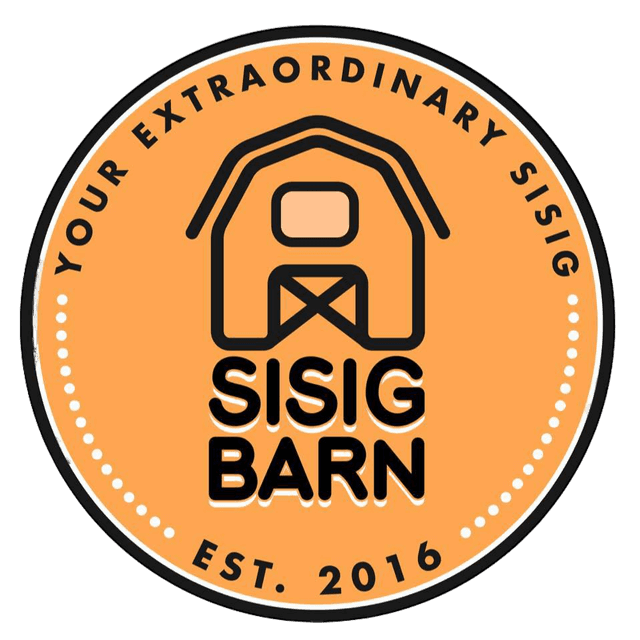

<div style="width: 100%; text-align: center;">
  
</div>

# Kiosk Web Application

Kiosk Web Application for Sisig Bam

### Installation

Nodejs and NPM must be installed on your system

```
git clone https://github.com/lrdnnsjr/kiosk_app

npm install

npm start
```

## References

- [NodeJS](https://nodejs.org/en/)
- [NPM](https://www.npmjs.com/)
- [ReactJS](https://reactjs.org/)
